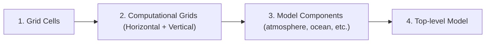
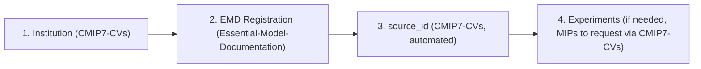

# CMIP7 Controlled Vocabulary Registration Guide

This guide explains how to register new entries in CMIP7 Controlled Vocabularies (CVs) such as institutions, models (source_id), experiments, and model documentation components.

---

## 1. Overview

CMIP7 uses **Controlled Vocabularies (CVs)** to ensure consistency across all participating modelling centres. Before publishing data, you must register:

- Your **institution**
- Your **model** (source_id)
- Any new **experiments** (if applicable, to be done by MIP leads)
- **Model documentation** (EMD) components

Registration is done through **GitHub issue forms** that are linked below (no Git expertise required).

!!! info "Data production overview:"
    Key steps for data preparation and publication readiness are outlined in the slides from [CMIP 2026 workshop WIP session](https://zenodo.org/records/18934629) (slides 30-36).

---

## 2. Registration Forms

### 2.1 Institution Registration

Register your institution before registering a model.
This requires the creation of two "objects"; the *institution member id* and the *institution id*.

In CMIP6 several institution ids represented a collection of multiple
institutes (see for example `E3SM-Project` and `EC-Earth-Consortium` within the 
[CMIP6 CVs](https://wcrp-cmip.github.io/CMIP6_CVs/docs/CMIP6_institution_id.html)). 
For CMIP7 this would be achieved through multiple *institution member* registrations and a single *institution id* registration. The institution id is then used in data preparation and publication processes.

If there is only a single institution member publishing under a single institution id then **it is necessary to complete both registration forms**, but only a single institution member needs to be referenced in the second form.

The complete the institution registration it is necessary to 

1. register as an 'institution member' with an associated ID (i.e. [DRS name](Global_Attributes.md#4-data-reference-syntax-drs-elements))
2. register for an institution ID (i.e. DRS name) based on the members that should be associated with the institution ID
    - If your institution ID is associated with a consortium, you will have more than one member and an institution ID that differs from those of your members
    - If your institution ID is associated with a single member, you will have one member and an institution ID that is the same as the the member's ID (i.e. DRS name).

**Repository**: [CMIP7-CVs](https://github.com/WCRP-CMIP/CMIP7-CVs) [Registered content for institutes](https://github.com/WCRP-CMIP/CMIP7-CVs/tree/main/institution), [Registered content for institute members](https://github.com/WCRP-CMIP/WCRP-universe/tree/esgvoc/institution)

| Form | Link | Required Fields |
|------|------|-----------------|
| Institution member | [Register Institution member](https://github.com/WCRP-CMIP/CMIP7-CVs/issues/new?template=register-institution-member.yml) | Title, ID (i.e. DRS name), description, [ROR](https://ror.org/) |
| Institution | [Register Institution](https://github.com/WCRP-CMIP/CMIP7-CVs/issues/new?template=register-institution.yml) | Title, ID (i.e. DRS name), description, members |
 
**Notes**:
- The **acronym** used for the institution id must be unique and cannot be changed once data is published
- An **ROR** (Research Organisation Registry) identifier is required for traceability. Find yours at [ror.org](https://ror.org)
- If you previously did the institution ID registration process, but your institution is not in the CVs, please [raise an issue in the CMIP7-CVs repository](https://github.com/WCRP-CMIP/CMIP7-CVs/issues/new?template=BLANK_ISSUE)

---

### 2.2 Model Registration (source_id)

**Important**: To register a `source_id`, you **must** complete the EMD (Essential Model Documentation) registration process.

Guidance on constructing a source id is provided in the [Source ID Guidance](Source_ID_guidance.md)

**Prerequisites**:
1. EMD registration completed (see 2.4) - including grids, components, and top-level Model

**Repository**: [CMIP7-CVs](https://github.com/WCRP-CMIP/CMIP7-CVs) [Registered Content](https://github.com/WCRP-CMIP/CMIP7-CVs/tree/main/institution) (content populated via [the EMD](https://github.com/WCRP-CMIP/Essential-Model-Documentation/tree/src-data/model))

Grid labels and Source IDs will be registered automatically within the CVs once the relevant EMD stages have been completed.
If you have completed the EMD but your source ID or grid label is not in the CVs,
please [open an issue in the CMIP7 CVs repository](https://github.com/WCRP-CMIP/CMIP7-CVs/issues/new?template=BLANK_ISSUE)
so we can figure out where the information processing has gone wrong.

---

### 2.3 Activity Registration

For new Activities (MIPs) not already in the CV.
If you previously did the activity registration process,
but your activity is not in the CV,
please check and engage on [this issue](https://github.com/WCRP-CMIP/CMIP7-CVs/issues/385)
which tracks the progress and process for adding these lost registrations
back into the CV.

**Repository**: [CMIP7-CVs](https://github.com/WCRP-CMIP/CMIP7-CVs) [Registered Content](https://github.com/WCRP-CMIP/CMIP7-CVs/tree/main/activity)

| Form | Link |
|------|------|
| Activity (MIP) | [Register activity](https://github.com/WCRP-CMIP/CMIP7-CVs/issues/new?template=register-activity.yml) |

---

### 2.4 Experiment Registration

For new experiments not already in the CV.
If you previously did the experiment registration process,
but your experiment is not in the CV,
please check and engage on [this issue](https://github.com/WCRP-CMIP/CMIP7-CVs/issues/385)
which tracks the progress and process for adding these lost registrations
back into the CV.

**Repository**: [CMIP7-CVs](https://github.com/WCRP-CMIP/CMIP7-CVs) [Registered Content](https://github.com/WCRP-CMIP/CMIP7-CVs/tree/main/experiment)

| Form | Link |
|------|------|
| Experiment | [Register experiment](https://github.com/WCRP-CMIP/CMIP7-CVs/issues/new?template=register-experiment.yml) |

---

### 2.5 Essential Model Documentation (EMD)

EMD provides detailed technical documentation of your model. Registration follows a **hierarchical process** - you must register components in order. This should take a maximum of 4 hours wall time (although not all at once, as **each step has a separate review process**). 

For information on the EMD **please read the [DOCUMENTATION](https://wcrp-cmip.github.io/Essential-Model-Documentation/docs/Information_for_Submitters/Submission-Guide/)**

Other links: [GitHub Repository](https://github.com/WCRP-CMIP/Essential-Model-Documentation/issues)

#### Registration Order

#### Available Forms

| Stage | Form | You provide | You receive |
|-------|------|-------------|-------------|
| 1 | [Grid cells](https://github.com/WCRP-CMIP/Essential-Model-Documentation/issues/new?template=horizontal_grid_cell.yml) | Geometry, coordinates | `g###` |
| 1b | [Vertical grid](https://github.com/WCRP-CMIP/Essential-Model-Documentation/issues/new?template=vertical_computational_grid.yml) | Coordinate type, levels | `v###` |
| 2a | [Horizontal computational grid](https://github.com/WCRP-CMIP/Essential-Model-Documentation/issues/new?template=horizontal_computational_grid.yml) | Grid cell IDs, staggering | `h###` |
| — | [Model family](https://github.com/WCRP-CMIP/Essential-Model-Documentation/issues/new?template=model_family.yml) | Institution, domains | Family ID |
| 3a | [New model component](https://github.com/WCRP-CMIP/Essential-Model-Documentation/issues/new?template=model_component.yml) | Component details, grid IDs | Component ID + Config ID |
| 3b | [(or) Link existing component](https://github.com/WCRP-CMIP/Essential-Model-Documentation/issues/new?template=link_existing_component.yml) | Component ID, grid IDs | Config ID |
| 4 | [Model](https://github.com/WCRP-CMIP/Essential-Model-Documentation/issues/new?template=model.yml) | Config IDs, coupling | `source_id` |

---

## 3. Registration Workflow

### Overall Registration Order

### Step-by-Step Process

1. **Check if already registered**: Before creating a new entry, verify it doesn't already exist (see links above for how to check)
2. **Fill the form**: Click the appropriate link and complete all required fields
3. **Submit**: This creates a GitHub issue
4. **Automated checks**: The system performs initial validation
5. **Review**: A reviewer checks your submission
6. **Feedback loop**: You may be asked to make corrections
7. **Approval**: Once approved, the entry is merged into the relevant repository

### Typical Timeline

- Simple registrations (institution, component configuration): 1-3 days
- Complex registrations (grid-cells, source-id): May take longer due to dependencies and clarifications

### Tips

- **Don't wait**: Start EMD registration early - dependencies mean sequential steps
- **Check dependencies**: A Model Component cannot reference a grid that isn't registered yet, a source cannot refer to components that don't exist. 
- **Be precise**: Acronyms and identifiers cannot be changed after data publication
- **Ask for help**: Consult the documentation first, and if needed use the general forms linked below for questions.

---

## 4. After Registration

Once your entries are registered:

1. The **esgvoc** library will include your entries in the next update
2. Your registered identifiers will appear as valid entries in the CMIP7 CMOR tables
3. Your model output netCDF files will be able to pass QA/QC validation for these CV fields

---

## 5. Tools & Resources

### esgvoc Library

The `esgvoc` Python library provides programmatic access to all CVs:

- GitHub: https://github.com/WCRP-CMIP/esgf-vocab
- Documentation: https://esgf.github.io/esgf-vocab/
- Accessing the CMIP7 CVs via esgvoc documentation: https://github.com/WCRP-CMIP/CMIP7-CVs#viewing-the-cvs-and-browsing-terms

### CV Repositories

| Repository | Content |
|------------|---------|
| [CMIP7-CVs](https://github.com/WCRP-CMIP/CMIP7_CVs/) | CMIP7-specific CVs |
| [WCRP-Universe](https://github.com/WCRP-CMIP/WCRP-Universe/) | ESGVOC collection for all WCRP-CMIP projects |
---

### EMD Repositories

These repositories maintain the information used by the EMD.
Some of the information is automatically translated out into the CV repositories,
but these EMD repositories are not themselves CV repositories.
**Your data is only registered in the CVs if it appears in the CVs repositories above. Registration in the EMD repositories alone is not registration in the CVs.  However the EMD information required by the CVs should automatically propagate into the CVs on successful completion of the relevant EMD stages.**

| Repository | Content |
|------------|---------|
| [WCRP-constants](https://github.com/WCRP-CMIP/WCRP-constants/) | Constants required to support the EMD |
| [Essential-Model-Documentation](https://github.com/WCRP-CMIP/Essential-Model-Documentation/) | EMD components |
---

## 6. Getting Help

- **Question about a specific CV value**: Open a [CV value issue](https://github.com/WCRP-CMIP/CMIP7-CVs/issues/new?template=cv-value.md) in the CMIP7 CVS repository
- **CV discussions**: See [Discussions on the CVs repo](https://github.com/WCRP-CMIP/CMIP7-CVs/discussions)
- **General questions**: Open a [blank issue](https://github.com/WCRP-CMIP/CMIP7-CVs/issues/new?template=BLANK_ISSUE) in the CMIP7 CVS repository and ask your question. Please include as much context and other helpful information as possible.
- **Contact IPO**: For complex or sensitive cases, contact the [CMIP International Project Office](mailto:cmip-ipo@esa.int)
